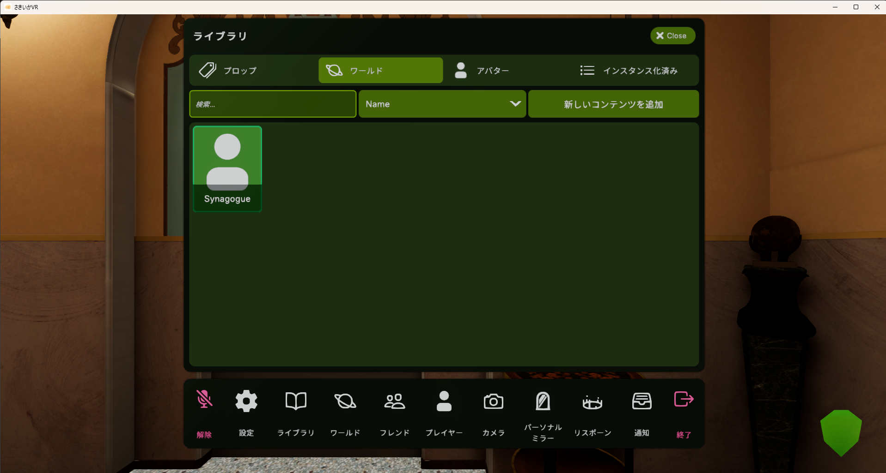
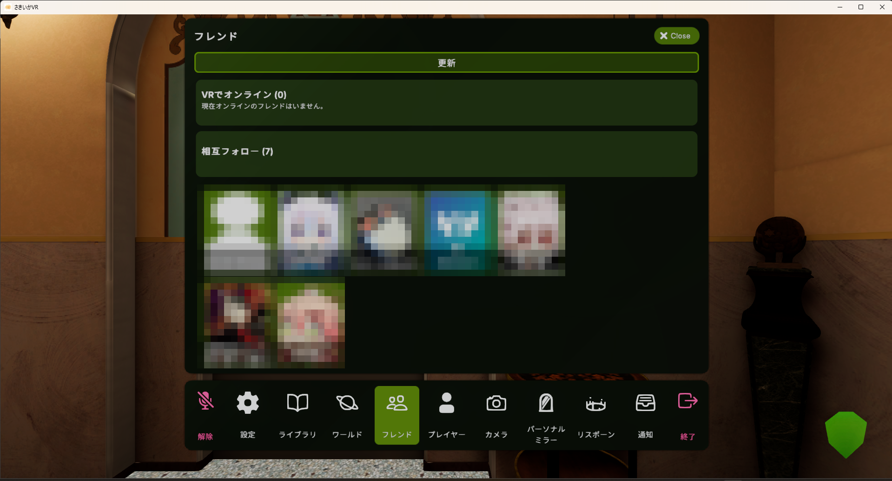
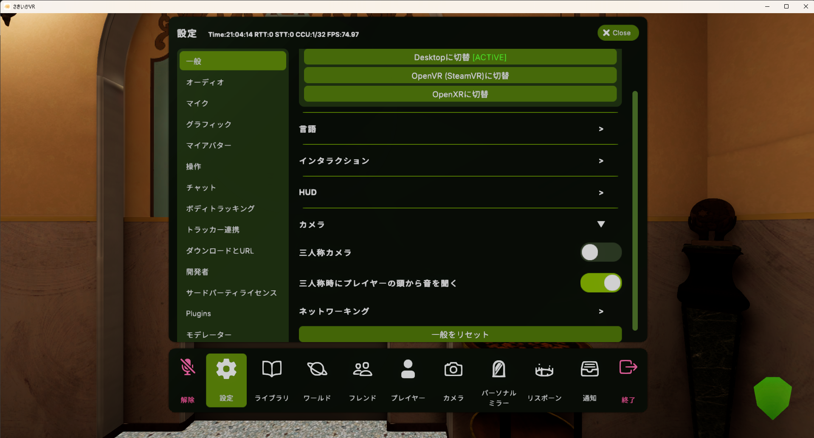

  

# さきいかVR

さきいかVRは、プレイヤー同士の通信とMisskey を使って、ワールドの公開・参加ができます。

> 現状、バグやグローバルIpのセキュリティが未完成なので気を付けてください。
> Built with Basis. 

## スクリーンショット

  
  
  

# 実装したい機能
・動画プレーヤー
・ワールド検索(Misskeyに投稿されたワールドをクライアント内で検索)

## ダウンロード

最新のWindowsビルドはReleasesから入手できます。

**➡ [最新リリースをダウンロード](../../releases/latest)**

## 開発への参加(プルリクエスト歓迎)

**誰でもプルリクエスト形式で開発に参加できます。** 小さなバグ修正、ドキュメントの改善、機能提案など、どんな些細な変更でも歓迎です。まずは1行の修正からでも大歓迎です。

1. このリポジトリを Fork する
2. 変更をコミットして Pull Request を送る
3. メンテナ(リポジトリオーナー)が内容を確認し、承認・マージします

> ⚠️ **レビューについてのお願い**
> 個人で開発・運用しているため、レビューやマージまでにお時間をいただくことがあります。あらかじめご了承ください。すべてのPRはオーナーの承認を経てマージされます。

---

## ワールドシステム仕様

専用のワールド管理サーバーを持たず、**プレイヤー自身がワールドをホストするP2P方式**と、**Misskeyを使った公開ワールド一覧**で成り立っています。従来の「サーバーに接続して入る」方式は廃止されました。

### ワールドを立てる(ホスト)

ライブラリの「ワールド」タブでワールドを選ぶと、次の2つの方法で開けます。

- **インバイトで開く** — 自分がホストになりワールドを立て、**接続文字列**(`IP:ポート#パスワード`)がクリップボードにコピーされます。これをフレンドに渡すと参加できます。一覧には公開されません。
- **パブリックで開く** — 上記に加えて、Misskeyに接続情報を含むノートを投稿します。他のプレイヤーの「ワールド」タブの一覧に表示され、誰でも参加できます。

ホストはBasisのホストモード(クライアント内にサーバーをインプロセス起動)を利用しており、**専用サーバーは不要**です。

### Misskeyログインと公開一覧(サーバーレス)

- ワールドの公開・参加には**Misskeyログインが必須**です(MiAuth方式。アプリにトークンを貼る必要はありません)。
- **ゲーム内のユーザー名にはMisskeyのアカウント名が使われます**(手動変更は不可)。
- 公開ワールドは Misskey のノート(ハッシュタグ `#SakiikaVRWorld` + 機械可読ペイロード)として告知され、クライアントはそのタグを検索して一覧を表示します。**独自のディレクトリサーバーは存在しません。**
- ホストを終了すると告知ノートは自動削除され、古い告知は一定時間で一覧から除外されます。

### NAT越え(ポート開放不要)

手動のポート開放なしで接続できるよう、段階的なNAT越えを実装しています。

- **ICE-lite(STUN + Misskeyシグナリング + UDPホールパンチ)** — 公開STUNサーバーで自分の公開アドレスを取得し、Misskeyのノート返信をシグナリングチャンネルとしてお互いのアドレスを交換、UDPパンチで直接接続します。**全錐/制限錐/ポート制限錐NATはポート開放なしで直結**でき、pingは2者間の生RTT(最良)になります。
- **TURN中継(対称型NAT対応)** — 対称型NATを自動検出した場合は、TURNサーバー経由でリレーして到達性を確保します(coturn、long-term認証)。この経路のみ中継分だけpingが増えます。
- STUN・Misskey・TURNは接続確立時のみ使用し、**ゲーム中の通信は直接P2P**なので遅延に影響しません。

### ホームワールド

ワールド詳細で「ホームワールドに設定」しておくと、**次回起動時に自動でそのワールドをインバイトセッションとして立てます**(Misskeyログイン済みが条件)。

### ワールドの切り替え(接続を維持したまま)

すでに自分がホストしている状態で別のワールドを開いたり、インバイト↔パブリックを切り替えたりした場合、**サーバーは再起動されず、ワールドだけがネットワーク越しに差し替わります**。

- **ワールド内にいる人は切断されません。** 全員がそのまま新しいワールドへ一緒に移動します(インスタンスを保ったままワールドを変更する挙動)。
- 接続文字列・パスワードは同じものが維持されます。
- インバイトで立てた後にパブリックへ切り替えると、その場でMisskeyへ公開告知が投稿されます。

### 制限事項

- 対称型NAT同士など一部の組み合わせは、TURNを介しても直結できない場合があります。
- 大人数のホストはホスト機の上り回線・CPUに依存します(全ゲストの通信がホストに集中するため)。

- 
「まるさんかくしかくサーバー」(nodokaha様)のTURNサーバーを使わせてもらっています。

---

## フレンド(相互フォロー一覧とインバイト)

メインメニューの「フレンド」パネルから、Misskeyの**相互フォロー**のユーザーをアイコン付きのグリッドで一覧できます。サーバーレス設計はワールド一覧と同じで、専用のフレンドサーバーはありません。

- **VRでオンライン** — 一覧の上部に、いまさきいかVRを起動中のフレンドが表示されます。オンライン状態は、クライアントがログイン中に定期投稿する**フォロワー限定のプレゼンスノート**(ハッシュタグ `#SakiikaVROnline`)で判定します(終了時に自動削除、古いノートは一定時間で無効)。パブリックワールドをホスト中の人もオンライン扱いになります。
- **インバイト** — オンラインのフレンドを選ぶと、自分が現在いるワールドへの招待をMisskeyの**ダイレクトノート(DM)**で送れます。受け取った側のクライアントには参加確認ダイアログが表示され、承認するとそのワールドに接続します。
- 表示名とアイコンはMisskeyのプロフィールがそのまま使われます。
- インバイトの受信にはMisskeyトークンの `read:account` 権限が必要です。以前のバージョンでログインした場合は、一度ログインし直してください(送信は再ログイン不要)。

## FaceCamera(表情確認カメラ)

[lilxyzw/FaceCamera](https://github.com/lilxyzw/FaceCamera)(MIT License)を統合しています。自分のアバターの顔を映す小窓を画面(VRではHUD)に表示し、表情を確認しながら遊べる機能です。

- **有効化** — 設定メニューの「Plugins」タブ → FaceCamera セクションで「有効」をオンにします(デフォルトはオフ)。
- **表示調整** — 小窓のアンカー位置(左上/右上/左下/右下)、不透明度、サイズ、オフセットをデスクトップ/VRそれぞれ個別に設定できます。
- **アバターごとの調整** — アバターカスタマイズメニューから、カメラの撮影範囲(Range)と高さオフセット(OffsetY)をアバター単位で保存できます。
- 表示は日本語/英語に対応しています。

## Emock(表情アニメーション)

[lilxyzw/Emock](https://github.com/lilxyzw/Emock)(MIT License)を統合しています。アバターの表情を制御するためのモックAnimatorControllerで、Animatorを使わず軽量に表情の切り替え・同期ができます。

- **仕組み** — オーナー側で条件分岐を解決(`EmockController`)し、アニメーションのインデックスだけをネットワーク送信(`EmockNetwork`)。受信側はそのインデックスのアニメーションを再生(`EmockAnimator`)し、補間はBurstジョブで処理されるため負荷が小さい設計です。
- **操作** — VRコントローラー(トラックパッド/トリガー/グリップ)または キーボードの `左Shift/右Shift + F1〜F8` で左右の手のパラメーターを切り替えます。
- **クライアント設定** — 設定メニューの「Plugins」タブ → Emock セクションで「コントローラーで操作」「移動時にリセット」「停止距離」を変更できます(日本語/英語対応)。
- **アバターメニュー** — アバターに `EmockMenuItem` が入っていれば、アバターカスタマイズメニューにボタン/トグル/ドロップダウンとして表示されます。
- **導入済みの対応** — Emockコンポーネント4種はアバターの許可リスト(ContentPolice)に登録済みで、Cilbox(ユーザースクリプト)からの `EmockController.SetParameter` / `EmockNetwork.SetIndex` 呼び出しにも対応済みです。アバター制作側は本家の手順どおり [lilEmo](https://github.com/lilxyzw/lilEmo) 等でセットアップしたアバターをそのまま使えます。

## lilBasisPatcher(プラグイン基盤)

依存プラグインの [lilxyzw/lilBasisPatcher](https://github.com/lilxyzw/lilBasisPatcher)(MIT License)を全機能同梱しています。lilxyzw製プラグイン(FaceCamera・Emockなど)が共有するコアライブラリで、以下の機能を提供します。

- **CommonSettings(Plugins設定タブ)** — 複数のプラグインが設定タブを乱立させないよう、設定メニューに共通の「Plugins」タブを1つ追加し、各プラグインがそこに設定UIを登録できるようにします。FaceCameraの設定もこのタブに表示されます。
- **AvatarSettings(アバター別設定の保存)** — プラグインの設定値をアバターごと(またはグローバル)に永続保存します。余計なファイルを増やさないよう、Vixxyと同じ保存ファイルを共用します。FaceCameraのアバター別Range/OffsetY保存に使われています。
- **UpdateInvoker(集中Update管理)** — 多数のコンポーネントが個別にUnityの `Update()`/`LateUpdate()` を持つオーバーヘッドを避けるため、常駐の単一コンポーネントが `IManagedUpdate` / `IManagedLateUpdate` 登録済みオブジェクトの更新を一括呼び出しします。
- **ComponentPatcher(Editor拡張)** — プラグインの独自コンポーネントをBasisのContentPolice許可リスト(アバター/プロップ/シーンにロードを許可するコンポーネントのホワイトリスト)へ安全に追記するエディタユーティリティです。重複登録を防ぎ、結果をダイアログで通知します。プラグイン側からユーザー操作で呼び出して使います。

各ライセンス全文は `Basis/Packages/jp.lilxyzw.facecamera/LICENSE`・`Basis/Packages/jp.lilxyzw.emock/LICENSE`・`Basis/Packages/jp.lilxyzw.basispatcher/LICENSE`、および[LICENSE](LICENSE)のThird-Party Code欄を参照してください。

## ライセンス

- **さきいかVR固有のコードは、さきいかVR本体での利用・貢献に限り許可されます。他のプロジェクトでの使用・流用・再配布は禁止です。**
- 開発参加のための Fork・改変・Pull Request の送付は、これまでどおり自由にできます(歓迎します)。
- ベースの [Basis](https://github.com/BasisVR/Basis) 由来のコードはMIT License、同梱のサードパーティ製コンポーネントはそれぞれのライセンスに従います。
- 詳細は [LICENSE](LICENSE) を参照してください。
